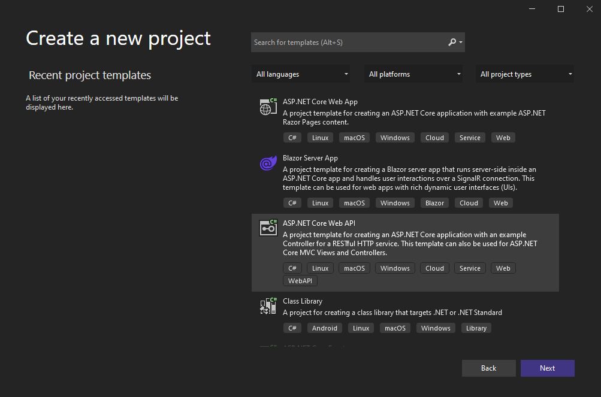
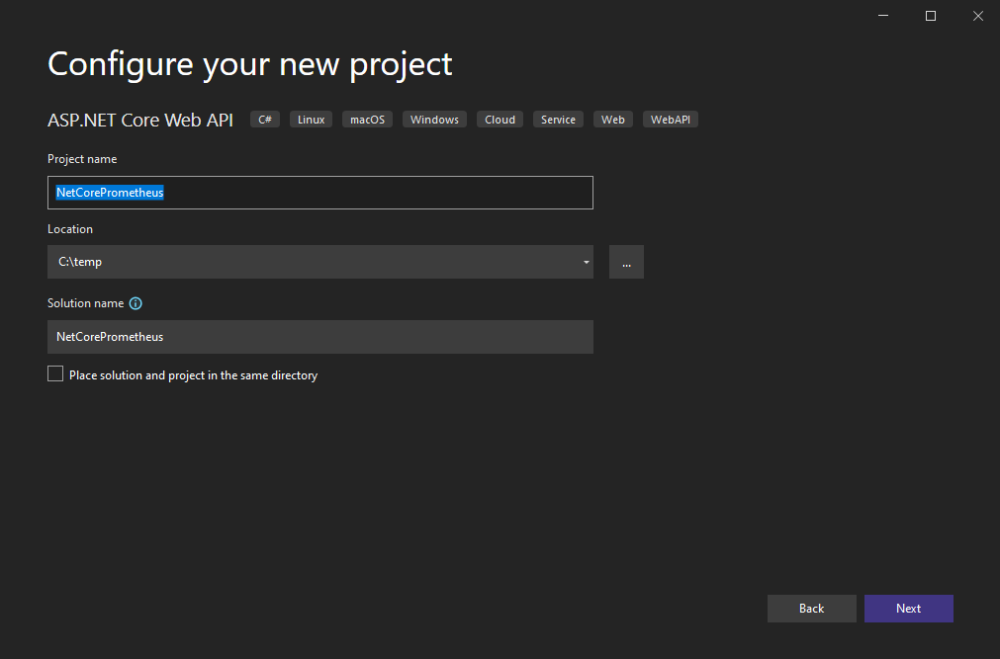
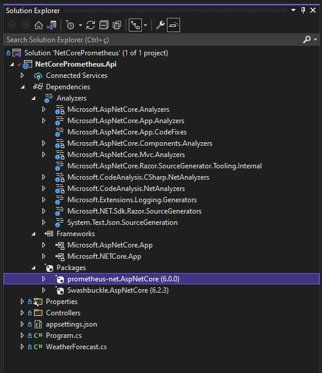

[![Contributors][contributors-shield]][contributors-url]
[![Watchers][watchers-shield]][watchers-url]
[![Stargazers][stars-shield]][stars-url]
[![Forks][forks-shield]][forks-url]
[![Issues][issues-shield]][issues-url]
[![MIT License][license-shield]][license-url]


# Monitorando aplicações .Net Core com Prometheus

>  Monitorar é a ação de: **"acompanhar alguma coisa para consideração, analisando as informações fornecidas por instrumentos técnicos; monitorizar: monitorar um processo, uma operação, um aparelho, etc"**.

---

<!-- TABLE OF CONTENTS -->
### Índice
<ol>
  <li><a href="#introducao">Introdução</a></li>
  <li><a href="#vantagens">Vantagens</a></li>
  <li><a href="#o-que-e-o-prometheus">O que é o Prometheus?</a></li>
  
  <li><a href="#projeto">Projeto</a></li>
  <ol>
    <li><a href="#api">API</a></li>
    <li><a href="#examples">Configurando o Prometheus</a></li>
    <li><a href="#examples">Docker</a></li>
    <li><a href="#examples">Testando</a></li>
  </ol>

  <li><a href="#como-posso-contribuir">Como posso contribuir?</a></li>
  <li><a href="#licenca">Licença</a></li>
  <li><a href="#sobre-o-autor">Sobre o autor</a></li>
  <!--
  <li><a href="#doacoes">Doações</a></li>
  -->
</ol>

---

## Introdução

O monitoramento de aplicações e servidores é uma parte importante do dia-a-dia do desenvolvedor de software. Isso inclui diversos tipos de análises, desde o monitoramento contínuo de possíveis exceções até o uso de CPU, memória e armazenamento do servidor. 

Outro item importante do monitoramento é a capacidade de configurar alarmes, por exemplo, você pode querer receber um alerta através de algum canal conhecido como e-mail, chat, sms, sempre que ocorrer alguma indisponibilidade ou falha de processo na sua API.

Um ponto relevante sobre métricas é entendermos o que é APM (Application Performance Management). APMs são serviços que visam garantir que os softwares atendam seus requisitos de desempenho e performance. Ele monitora pontos sobre velocidade de transações de softwares, infraestrutura de rede, sistemas entre outros. São software que auxiliam no troubleshooting de aplicaçõe para resolução de problemas.

## Vantagens

Podemos destacar várias vantagens de usar essas ferramentas para aumentar o controle de dados. Como estamos olhando muito para a Open Finance este ano, podemos falar um pouco sobre como estas ferramentas podem ajudar a trazer controle e governança sobre os processos bancários.

Quando você integra seu software com as APIs do banco, você abre uma gama de possibilidades, mas e quanto ao controle de tudo isso? Como monitorar se os serviços que suportam essas interações estão funcionando corretamente? A resposta a estas perguntas é o monitoramento, que pode ser feito usando o Prometheus, AlertManager, Grafana e outros sistemas.

Ao ter um monitoramento eficaz, você pode:

1. Ter mais agilidade na solução de problemas;
2. Identificar instabilidades e picos de transação de alto volume;
3. Maior controle de dados.

E estes são alguns dos muitos benefícios que o rastreamento de dados pode trazer ao seu negócio.

## O que é o Prometheus?

De acordo com o [github da ferramenta](https://github.com/prometheus/prometheus), o **Prometheus** é um sistema de monitoramento para serviços e aplicações. Ele coleta as métricas de seus alvos em determinados intervalos, avalia expressões de regras, exibe os resultados e também pode acionar alertas se alguma condição for observada como verdadeira.

Dentre muitas, estas são principais características do Prometheus:

* É um modelo de dados multi-dimensional (time series).
* Possui uma linguagem própria (PromQL) para queries de dados em formato time series.
* Totalmente autônomo, sem dependência de armazenamento externo.
* A coleta das métricas ocorre com um modelo pull e via HTTP.
* Também é possível enviar métricas através de um gateway intermediário.
* A definição dos serviços a serem monitorados pode ser feita através de uma configuração estática ou através de descoberta.
* Possui vários modos de suporte a gráficos e painéis.

Este tutorial tem como objetivo de focar no entendimento sobre como configurar a coleta de métricas — utilizando o modelo pull via HTTP — na sua aplicação e também a visualização delas. Sendo assim, aqui não serão abordados assuntos como configuração e implantação do Prometheus. Contudo, para ter uma ideia do funcionamento geral da ferramenta, é interessante entender como funcionam os componentes internos do Prometheus.

## Projeto

O projeto de exemplo irá mostrar como é feito a configuração do Prometheus em uma API com .Net Core 6.0.


### API

A biblioteca que iremos utilizar pode ser encontrada no [Nuget](https://github.com/prometheus-net/prometheus-net) (utilizaremos a ultima versão até o momento de escrita deste artigo v6.0.0):

```xml
<PackageReference Include="prometheus-net.AspNetCore" Version="6.0.0" />
```

Iremos criar uma ASP.NET Core (RESTful) Web API, para isso siga o próximo passos:

Inicie o Visual Studio e clique em Create a new project


Escolha o tipo de projeto: ASP.NET Core Web Application



Escolha o Nome para seu projeto, nosso exemplo irá se chamar: web-api-metrics e o local que o seu projeto irá ficar no seu computador. Agora clique em Create



Escolha API e clique em Create.


No Solution Explorer veremos as dependência do projeto


Neste momento iremos buscar a biblioteca prometheus-net.AspNet no Nuget.
Abra o Package Manager Console e execute o seguinte comando:

```bash
Install-Package prometheus-net.AspNetCore -Version 6.0.0
```


Após a instalação, poderemos ver a biblioteca nas dependências do projeto.



Agora iremos incluir a configuração do Prometheus na classe Startup.cs


O parte da configuração customizada irá nos ajudar a gerar informações de todas as requisições que nossas controllers irão receber.


Mude o launch do projeto para web_api_metrics


Uma última configuração na API, no arquivo launchSettings.json, modifique o valor da propriedade launchUrl para metrics.


Após essa última configuração, ao executarmos a aplicação pressionando “F5” poderemos ver o endpoint “/metrics” que a biblioteca do Prometheus criou para monitorar as informações da nossa API..


## Como posso contribuir?

Se você quer ajudar o projeto, aprimorando-o ou criando algo novo, seja bem-vindo. Este projeto foi criado para ser um lar de códigos úteis e reutilizáveis ​​para a comunidade .NET. Portanto, se você tiver algum trecho de código útil, limpo, desacoplado e testado e quiser contribuir para esse objetivo, faça um [pull request](https://github.com/anzolin/netcoreprometheus/pulls)!


## Licença

Este projeto sob a [Licença MIT](https://github.com/anzolin/netcoreprometheus/blob/master/LICENSE).

  
## Sobre o autor

Olá a todos, eu me chamo Diego Anzolin Ferreira. Eu sou um desenvolvedor .Net. Espero que você goste deste projeto tanto quanto eu gostei de desenvolvê-lo. Se você tiver algum problema, você pode postar uma [issue](https://github.com/anzolin/netcoreprometheus/issues). Você pode me contatar em diego@anzolin.com.br.


<!--
## Doações
  
Quer me ajudar a continuar criando projetos open source, faça uma doação:

[](https://www.paypal.com/donate?business=DN2VPNW42RTXY&no_recurring=0&currency_code=BRL) [](https://www.buymeacoffee.com/anzolin)

-->
Obrigado!


<!-- MARKDOWN LINKS & IMAGES -->
<!-- https://www.markdownguide.org/basic-syntax/#reference-style-links -->
[contributors-shield]: https://img.shields.io/github/contributors/anzolin/netcoreprometheus.svg?style=for-the-badge
[contributors-url]: https://github.com/anzolin/netcoreprometheus/graphs/contributors
[forks-shield]: https://img.shields.io/github/forks/anzolin/netcoreprometheus.svg?style=for-the-badge
[forks-url]: https://github.com/anzolin/netcoreprometheus/network/members
[watchers-shield]: https://img.shields.io/github/watchers/anzolin/netcoreprometheus.svg?style=for-the-badge
[watchers-url]: https://github.com/anzolin/netcoreprometheus/watchers
[stars-shield]: https://img.shields.io/github/stars/anzolin/netcoreprometheus.svg?style=for-the-badge
[stars-url]: https://github.com/anzolin/netcoreprometheus/stargazers
[issues-shield]: https://img.shields.io/github/issues/anzolin/netcoreprometheus.svg?style=for-the-badge
[issues-url]: https://github.com/anzolin/netcoreprometheus/issues
[license-shield]: https://img.shields.io/github/license/anzolin/netcoreprometheus.svg?style=for-the-badge
[license-url]: https://github.com/anzolin/netcoreprometheus/blob/master/LICENSE.txt


<!--

https://medium.com/guide-lab/monitoramento-prometheus-grafana-e-net-core-3-1-parte-1-63a43b845e9f

https://medium.com/guide-lab/monitoramento-prometheus-grafana-e-net-core-3-1-parte-2-5f1c590b6c7f

-->