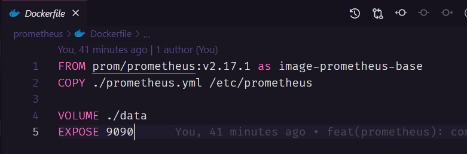
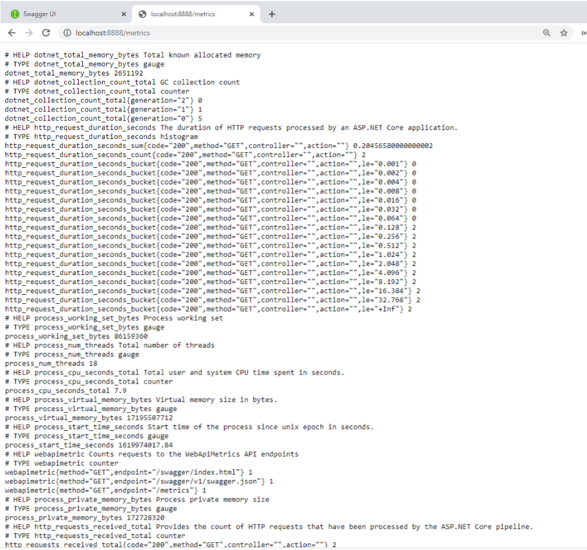
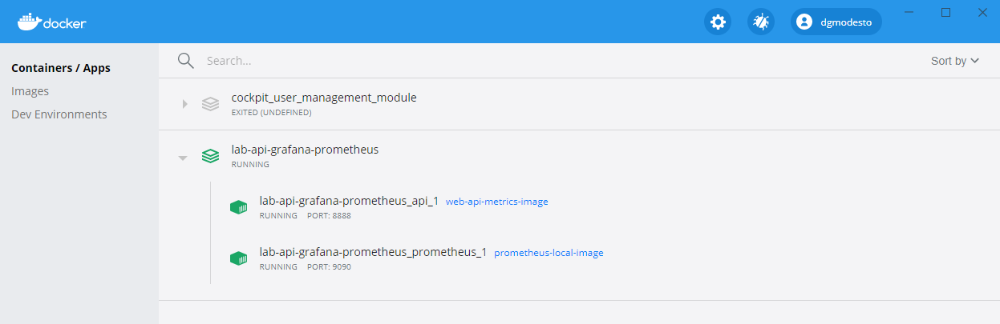
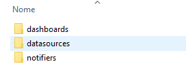
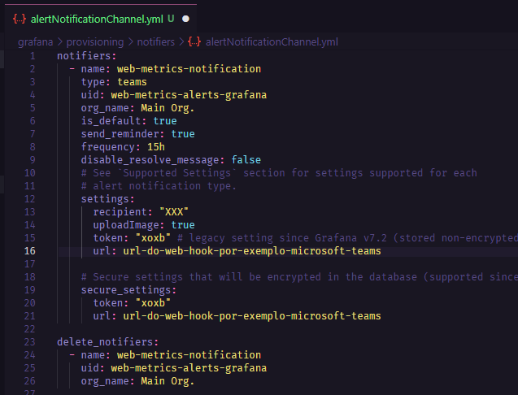
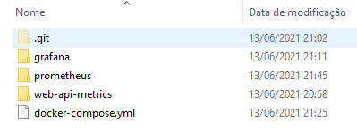

[![Contributors][contributors-shield]][contributors-url]
[![Watchers][watchers-shield]][watchers-url]
[![Stargazers][stars-shield]][stars-url]
[![Forks][forks-shield]][forks-url]
[![Issues][issues-shield]][issues-url]
[![MIT License][license-shield]][license-url]


# Monitorando aplicações .Net Core com Prometheus

>  Monitorar é a ação de: **"acompanhar alguma coisa para consideração, analisando as informações fornecidas por instrumentos técnicos; monitorizar: monitorar um processo, uma operação, um aparelho, etc"**.

---

<!-- TABLE OF CONTENTS -->
### Índice
<ol>
  <li><a href="#introducao">Introdução</a></li>
  <li><a href="#vantagens">Vantagens</a></li>
  <li><a href="#o-que-e-o-prometheus">O que é o Prometheus?</a></li>
  
  <li><a href="#projeto">Projeto</a></li>
  <ol>
    <li><a href="#api">API</a></li>
    <li><a href="#configurando-o-prometheus">Configurando o Prometheus</a></li>
    <li><a href="#docker">Docker</a></li>
    <li><a href="#testando">Testando</a></li>
  </ol>

  <li><a href="#como-posso-contribuir">Como posso contribuir?</a></li>
  <li><a href="#licenca">Licença</a></li>
  <li><a href="#sobre-o-autor">Sobre o autor</a></li>
  <!--
  <li><a href="#doacoes">Doações</a></li>
  -->
</ol>

---

## Introdução

O monitoramento de aplicações e servidores é uma parte importante do dia-a-dia do desenvolvedor de software. Isso inclui diversos tipos de análises, desde o monitoramento contínuo de possíveis exceções até o uso de CPU, memória e armazenamento do servidor. 

Outro item importante do monitoramento é a capacidade de configurar alarmes, por exemplo, você pode querer receber um alerta através de algum canal conhecido como e-mail, chat, sms, sempre que ocorrer alguma indisponibilidade ou falha de processo na sua API.

Um ponto relevante sobre métricas é entendermos o que é APM (Application Performance Management). APMs são serviços que visam garantir que os softwares atendam seus requisitos de desempenho e performance. Ele monitora pontos sobre velocidade de transações de softwares, infraestrutura de rede, sistemas entre outros. São software que auxiliam no troubleshooting de aplicaçõe para resolução de problemas.

## Vantagens

Podemos destacar várias vantagens de usar essas ferramentas para aumentar o controle de dados. Como estamos olhando muito para a Open Finance este ano, podemos falar um pouco sobre como estas ferramentas podem ajudar a trazer controle e governança sobre os processos bancários.

Quando você integra seu software com as APIs do banco, você abre uma gama de possibilidades, mas e quanto ao controle de tudo isso? Como monitorar se os serviços que suportam essas interações estão funcionando corretamente? A resposta a estas perguntas é o monitoramento, que pode ser feito usando o Prometheus, AlertManager, Grafana e outros sistemas.

Ao ter um monitoramento eficaz, você pode:

1. Ter mais agilidade na solução de problemas;
2. Identificar instabilidades e picos de transação de alto volume;
3. Maior controle de dados.

E estes são alguns dos muitos benefícios que o rastreamento de dados pode trazer ao seu negócio.

## O que é o Prometheus?

De acordo com o [github da ferramenta](https://github.com/prometheus/prometheus), o **Prometheus** é um sistema de monitoramento para serviços e aplicações. Ele coleta as métricas de seus alvos em determinados intervalos, avalia expressões de regras, exibe os resultados e também pode acionar alertas se alguma condição for observada como verdadeira.

Dentre muitas, estas são principais características do Prometheus:

* É um modelo de dados multi-dimensional (time series).
* Possui uma linguagem própria (PromQL) para queries de dados em formato time series.
* Totalmente autônomo, sem dependência de armazenamento externo.
* A coleta das métricas ocorre com um modelo pull e via HTTP.
* Também é possível enviar métricas através de um gateway intermediário.
* A definição dos serviços a serem monitorados pode ser feita através de uma configuração estática ou através de descoberta.
* Possui vários modos de suporte a gráficos e painéis.

Este tutorial tem como objetivo de focar no entendimento sobre como configurar a coleta de métricas — utilizando o modelo pull via HTTP — na sua aplicação e também a visualização delas. Sendo assim, aqui não serão abordados assuntos como configuração e implantação do Prometheus. Contudo, para ter uma ideia do funcionamento geral da ferramenta, é interessante entender como funcionam os componentes internos do Prometheus.

## Projeto

O projeto de exemplo irá mostrar como é feito a configuração do Prometheus em uma API com .Net Core 6.0.


### API

Iremos criar uma ASP.NET Core Web API, para isso siga o próximo passos:

Inicie o Visual Studio e clique em Create a new project


Escolha o tipo de projeto: ASP.NET Core Web API


Escolha o Nome para seu projeto, nosso exemplo irá se chamar: NetCorePrometheus e o local que o seu projeto irá ficar no seu computador. Agora clique em Create


Escolha API e clique em Create.


No Solution Explorer veremos as dependência do projeto


A biblioteca que iremos utilizar pode ser encontrada no [Nuget](https://github.com/prometheus-net/prometheus-net) (utilizaremos a ultima versão até o momento de escrita deste artigo v6.0.0):

```xml
<PackageReference Include="prometheus-net.AspNetCore" Version="6.0.0" />
```

Neste momento iremos buscar a biblioteca prometheus-net.AspNet no Nuget.
Abra o Package Manager Console e execute o seguinte comando:

```bash
Install-Package prometheus-net.AspNetCore
```


Após a instalação, poderemos ver a biblioteca nas dependências do projeto.


Agora iremos incluir a configuração do Prometheus na classe 'Program.cs'. Portanto, vamos criar uma nova classe denominada `PrometheusConfig.cs` com a seguinte estrutura:

```csharp
    public static class PrometheusConfig
    {
        public static IApplicationBuilder UsePrometheusConfiguration(this IApplicationBuilder app)
        {
            // Custom Metrics to count requests for each endpoint and the method
            var counter = Metrics.CreateCounter("webapimetric", "Counts requests to the WebApiMetrics API endpoints",
                new CounterConfiguration
                {
                    LabelNames = new[] { "method", "endpoint" }
                });

            app.Use((context, next) =>
            {
                counter.WithLabels(context.Request.Method, context.Request.Path).Inc();
                return next();
            });

            // Use the prometheus middleware
            app.UseMetricServer();
            app.UseHttpMetrics();

            return app;

        }
    }
```

Na classe `Program.cs`, iremos adicionar a chamada da classe recém criada antes de HttpsRedirection:

```csharp
...
app.UsePrometheusConfiguration(); // Configuração do Prometheus
app.UseHttpsRedirection();
...

```


O parte da configuração customizada irá nos ajudar a gerar informações de todas as requisições que nossas controllers irão receber.

```csharp
            // Custom Metrics to count requests for each endpoint and the method
            var counter = Metrics.CreateCounter("webapimetric", "Counts requests to the WebApiMetrics API endpoints",
                new CounterConfiguration
                {
                    LabelNames = new[] { "method", "endpoint" }
                });

            app.Use((context, next) =>
            {
                counter.WithLabels(context.Request.Method, context.Request.Path).Inc();
                return next();
            });
```

Mude o launch do projeto para NetCorePrometheus.Api


Uma última configuração na API, no arquivo launchSettings.json, modifique o valor da propriedade launchUrl para metrics.


Após essa última configuração, ao executarmos a aplicação pressionando “F5” poderemos ver o endpoint “/metrics” que a biblioteca do Prometheus criou para monitorar as informações da nossa API..


Muito bem, neste momento, temos nossa api devidamente configurada para gerar suas métricas.

---

`Models\Cpf.cs`
```csharp
namespace NetCorePrometheus.Api.Models
{
	public class Cpf
	{
		public string Number { get; private set; }
		public bool IsValid { get; private set; }

		public Cpf(string cpf)
		{
			IsValid = IsCpf(cpf);
			Number = cpf;
		}

		public string GetNumber()
		{
			return Number;
		}

		private bool IsCpf(string number)
		{
			int[] multiplicador1 = new int[9] { 10, 9, 8, 7, 6, 5, 4, 3, 2 };
			int[] multiplicador2 = new int[10] { 11, 10, 9, 8, 7, 6, 5, 4, 3, 2 };
			string tempCpf;
			string digito;
			int soma;
			int resto;

			number = number.Trim();
			number = number.Replace(".", "").Replace("-", "");

			if (number.Length != 11)
				return false;

			tempCpf = number.Substring(0, 9);
			soma = 0;

			for (int i = 0; i < 9; i++)
				soma += int.Parse(tempCpf[i].ToString()) * multiplicador1[i];

			resto = soma % 11;

			if (resto < 2)
				resto = 0;
			else
				resto = 11 - resto;

			digito = resto.ToString();
			tempCpf = tempCpf + digito;
			soma = 0;

			for (int i = 0; i < 10; i++)
				soma += int.Parse(tempCpf[i].ToString()) * multiplicador2[i];

			resto = soma % 11;

			if (resto < 2)
				resto = 0;
			else
				resto = 11 - resto;

			digito = digito + resto.ToString();

			return number.EndsWith(digito);
		}
	}
}
```

`Models\Cliente.cs`
```csharp
namespace NetCorePrometheus.Api.Models
{
    public class Cliente
    {
        public Cliente(int id, string name, string email, string cpf)
        {
            Id = id;
            Name = name;
            Email = email;
            Cpf = new Cpf(cpf);
        }

        public int Id { get; set; }
        public string Name { get; set; }
        public string Email { get; set; }
        public Cpf Cpf { get; set; }

        public bool Validate()
        {
            bool isValid = true;

            if (string.IsNullOrWhiteSpace(Name) || string.IsNullOrWhiteSpace(Email) || Cpf.IsValid)
                isValid = false;

            return isValid;
        }
    }
}
```

`Repositories\ClienteRepository.cs`
```csharp
using NetCorePrometheus.Api.Models;

namespace NetCorePrometheus.Api.Repositories
{
    public class ClienteRepository
    {
        private List<Cliente> _clientes;

        public ClienteRepository()
        {
            _clientes = new List<Cliente>
            {
                new Cliente(1, "Douglas Modesto", "d.modesto@teste.com.br", "045.213.920-16"),
                new Cliente(1, "Martin Diogo Filipe Anthony Jesus", "martindiogojuanjesus__martindiogojuanjesus@urbam.com.br", "980.725.820-03"),
                new Cliente(1, "Diogo Nicolas Carvalho", "diogonicolascarvalho-74@saa.com.br", "406.244.580-83"),
                new Cliente(1, "Ericka Sebastião Silveira", "eerickantoniosilveira@transtelli.com.br", "705.559.730-77"),
                new Cliente(1, "Laura Jaqueline Aline Silva", "laurajaquelinealinesilva__laurajaquelinealinesilva@me.com", "711.605.230-53")
            };
        }

        public Cliente ClienteById(int idCliente)
        {
            return _clientes.FirstOrDefault(x => x.Id == idCliente);
        }

        public IEnumerable<Cliente> GetClientes()
        {
            return _clientes;
        }

        public bool Save(Cliente cliente)
        {
            return true;
        }
    }
}
```

`Controllers\ClienteController.cs`
```csharp
using Microsoft.AspNetCore.Mvc;
using NetCorePrometheus.Api.Models;
using NetCorePrometheus.Api.Repositories;

namespace NetCorePrometheus.Api.Controllers
{
    [ApiController]
    [Route("api/clientes")]
    public class ClienteController : ControllerBase
    {
        private readonly ILogger<ClienteController> _logger;
        private ClienteRepository _clienteRepository;

        public ClienteController(ILogger<ClienteController> logger)
        {
            _logger = logger;
            _clienteRepository = new ClienteRepository();
        }

        [HttpGet]
        [Route("")]
        public IEnumerable<Cliente> Clientes()
        {
            return _clienteRepository.GetClientes();
        }


        [HttpGet]
        [Route("cliente")]
        public Cliente ClienteById([FromQuery] int id)
        {
            return _clienteRepository.ClienteById(id);
        }
    }
}
```


---


Agora que sabemos o que é o Prometheus e o seu propósito, vamos ver ele trabalhando na prática. O objetivo é entendermos como o Prometheus Server funciona e como podemos configurá-lo para coletar métricas da nossa api.


### Docker

#### Pré-requisitos

Afim de termos uma boa experiência com o laboratório proposto neste artigo, será necessário a instalação de algumas ferramentas que são o Docker e Docker Compose.

Segue abaixo os links das instalações oficiais:

* [Docker CE (Community Edition)](https://docs.docker.com/engine/install/)
* [Docker Compose](https://docs.docker.com/compose/install/#install-compose)


#### Recapitulando

* Criamos uma controle para Listagem de Clientes e Buscar Cliente por Id
* Configuramos o Swagger para termos nossos endpoints documentados
* Criamos uma configuração para abrir o swagger no start da aplicação.
* Criamos um Dockerfile para fazer o deploy da aplicação dentro de um container.

Após as atualizações, ao iniciarmos nosso projeto, no endpoint localhost:8888/swagger/index.html, ele irá abrir nosso swagger, conforme imagem abaixo.


## Configurando o Prometheus

No diretório onde se encontra a pasta Root da nosso serviço web-api-metrics, iremos criar uma nova pasta com nome prometheus e também iremos criar um arquivo chamado docker-compose.yml. O diretório deverá ficar conforme imagem abaixo.


Na pasta prometheus iremos incluir as configurações do prometheus para ele rodar dentro do conteiner do docker.
Não se preocupe com o conteúdo do arquivo docker-compose.yml, mais a frente iremos incluir algumas configurações e cada uma dessas configurações será explicada e detalhada.

Dentro da pasta prometheus iremos criar alguns arquivos e diretórios que seguem:

* crie um arquivo chamado Dockerfile (perceba que o arquivo Dockerfile não tem extensão)
* crie um arquivo chamado prometheus.yml
* crie uma pasta chamada data


No arquivo Dockerfile iremos configurar a imagem do prometheus como segue abaixo:



Neste arquivo estamos:

* Buscando a imagem do prometheus prom/prometheus:v2.17.1
* Copiando nosso arquivo prometheus.yml para dentro do diretório /etc/prometheus que irá se econtrar dentro do contêiner
* Definimos um volume na pasta /data para persitir nossas informações do prometheus no host caso percamos nosso container.
* Estamos expondo a imagem na porta 9090


No arquivo prometheus.yml iremos incluir algumas configurações.


Neste arquivos estamos:

* Setando o intervalo de 5 segundos para que o prometheus realize o pull das métricas
* Estamos dando o nome web-api-metrics-job para o job do prometheus
* Incluindo o endereço que o nosso serviço estará rodando e qual caminho ele irá encontrar as métricas /metrics
* observação: Onde está o endereço IP, você deverá coloca o IP da sua máquina. Estamos utilizando o IP por que o prometheus e a nossa api irão se comunicar via containers do docker.


A princípio, essa são as configurações que devemos fazer no Prometheus para ele passar a buscar as informações que nossa api está gerando no endpoint /metrics



Agora voltaremos para o diretório raiz do nosso projeto, para incluir as configurações necessárias no nosso arquivo docker-compose.yml


Vamos entrar um pouco mais no detalhe desse arquivo.
Dentro de services, temos dois serviços configurados que são api e prometheus.

No service api, estamos fazendo o seguinte:

* Na tag context estamos dizendo nosso contexto é dentro do diretório /web-api-metrics, e que dentro desse diretório existe um arquivo Dockerfile.
* Na tag image estamos dando um nome para a nossa imagem, que é web-api-metrics-image
* Na tag port estamos fazendo o mapeamento das portas, onde o serviço roda na porta 80 dentro do container, e iremos expor a porta 8888 para o host.
* Na tag networks estamos apontando pra nossa configuração de rede web_api_metrics_networks onde os containeres irão se comunicar.


No service prometheus, estamos fazendo o seguinte:

* Na tag context estamos dizendo nosso contexto é dentro do diretório /prometheus, e que dentro desse diretório existe um arquivo Dockerfile.
* Na tag image estamos dando um nome para a nossa imagem, que é prometheus-local-image
* Na tag restart quando colocamos always significa que o contêiner será reinicializado sempre que houver alguma atualização.
* Na tag port estamos fazendo o mapeamento das portas, onde o serviço roda na porta 9090 dentro do container, e iremos expor a porta 9090.
* Na tag networks estamos apontando pra nossa configuração de rede web_api_metrics_networks onde os containeres irão se comunicar.


Em networks, estamos fazendo o seguinte:

* criamos uma rede com o nome web_api_metrics_network
* e colocamos o driver como overlay, isso significa que criamos uma rede distribuída em vários hosts daemon do Docker. Essa rede fica no topo (sobrepõe) as redes especificas do host.


Em teoria é isso, com as configurações que temos até o momento, já podemos rodar nosso projeto e ver o prometheus coletando as informações.

Antes de executar os próximos comandos do Docker, certifique-se que o Docker da sua máquina esteja rodando, blz?

Vamos lá, abra um Command Line da sua preferença, navegue até o diretório onde está nosso arquivo docker-compose.yml no diretório raiz do nosso projeto.


Após isso execute o seguinte comando:

* docker-compose up


Após a execução do comando docker-compose up, a construção dos containeres da nossa api e do prometheus deverão ser construidos.

No Windows temos um recurso bem interessante para gerenciarmos nossos conteineres que é o Docker Desktop. Ele oferece uma forma visual para conseguirmos analisar nossos conteineres conforme imagem abaixo.



Nesta tela podemos ver nossos dois conteineres em execução, o contêiner da api e o contêiner do prometheus.


Podemos observar que nossa api tem dois endpoints, o endpoint /api/customers é onde iremos realizar a listagem de clientes, e o endpoint /api/customers/customer é onde iremos buscar o cliente pelo seu codigo de identificação.

A ideia é que, sempre que recebermos alguma requisição nesses endpoints, o prometheus contabilize pra gente quantas requisições esses endpoints receberam, entre outras métricas que veremos a seguir.

Vamos ver agora a interface do prometheus que estamos executando pelo Docker na porta 9090


## Testando nosso cenário


Nossa API web-api-metrics está rodando na porta 8888, conforme configuramos no arquivo docker-compose.yml.

Se abrimos no navegador a url http:localhost:8888/metrics iremos ver as metricas geradas pela biblioteca do prometheus para o .Net Core.


Para acessarmos o swagger da API, devemos navegar na url: http:localhost:8888/swagger/index.hml . então veremos a documentação da API, onde iremos realizar nossos testes.


Podemos perceber que o prometheus está observando nossa api no endpont e porta que configuramos, localhost:8888/metrics

Após realizar algumas requisições nos endpoints de listagem de clientes, e busca de cliente por id, podemos ver as seguintes informações no prometheus:

* Quantidade de requisições por endpoint


* Gráfico de quantidade de requisições por endpoint


* Gráfico que verifica se nossa api está funcionando


* Gráfico que mostra o processamento da CPU por segundo


Existem diversos tipos de métricas que podemos capturar com o Prometheus, as métricas apresentadas acima são apenas algumas.

Com apenas algumas configurações, podemos tirar métricas valiosas dos nossos serviços com o objetivo de prover disponibilidade e qualidade para os mesmos.

Você deve estar se perguntando, ok entendi, mas e ai?

* Só conseguimos gerar esse tipo de gráfico?
* E se eu quiser customizar os gráfico e criar um dashboard com as informações que eu achar importante de forma consolidada, como eu faço isso?

Para responder essas perguntas, eu vou lhe apresentar o Grafana.

## Grafana

### O que é o grafana?

Grafana é uma aplicação web que fornece visualização interativa dos dados. Ele fornece diversos recursos de visualização como tabelas, gráficos, mapas de calor, painéis de textos livre e alertas. É expansível através de um sistema de plug-ins, os usuários finais podem criar painéis de monitoramento complexos usando consultas interativas representando métricas específicas em um determinado período de tempo, como veremos a seguir.


### Por que utilizar o Grafana?

Com essa ferramenta poderosa podemos compartilhar informações importantes com toda a equipe, informações que podem vir de diferentes fontes de dados, como bancos de dados, planilhas de excel, plugins entre outras tantas, e com isso consolidar todas essas informaçõe em um lugar centralizado por meio de uma única interface intuitiva e completa. Isso pode facilitar o gerenciamento dos indicadores e facilitar a tomada de decisão de forma rápida e eficiente.

### Mão na massa
Agora que sabemos que é o Grafana e o seu propósito, assim como fizemos com o prometheus no artigo anterior, vamos ver ele trabalhando na prática. Nosso objetivo será entender como o Grafana funciona e como podemos criar dashboards customizáveis de forma rápida e eficiente.

#### Pré-requisitos
Afim de termos uma boa experiência com o laboratório proposto neste artigo, será necessário a instalação de algumas ferramentas que são o Docker e Docker Compose.

Segue abaixo os links das instalações oficiais:

* [Docker CE (Community Edition)](https://docs.docker.com/engine/install/)
* [Docker Compose](https://docs.docker.com/compose/install/#install-compose)


### Configurando o Grafana

No diretório onde se encontra a pasta Root do nosso projeto web-api-metrics, iremos criar uma nova pasta com nome grafana.

Dentro dela, criaremos as seguintes pastas e arquivos (vamos detalhar um-por-um a seguir):


Na pasta grafana iremos incluir as configurações do grafana para ele rodar dentro de um contêiner do docker.

Dentro da pasta grafana iremos criar alguns arquivos e diretórios que seguem:

* crie um arquivo chamado Dockerfile (perceba que o arquivo Dockerfile não tem extensão).
* crie três pastas com os seguintes nomes: config, dashboards e provisioning


* dentro do diretório config crie um arquivo com nome grafana.ini


* dentro do diretório dashboards crie um arquivo com nome dashboard-webmetric.json


* dentro do diretório provisioning crie os seguintes diretórios: dashboards, datasource e notifiers



* dentro do diretório dashboards em provisioning crie um arquivo com nome dashboard.yml


* dentro do diretório datasource crie um arquivo com nome datasource.yml


* dentro do diretório notifiers crie um arquivo com nome alertNotificationChannel.yml


No arquivo Dockerfile iremos configurar a imagem do grafana como segue abaixo:


Neste arquivo estamos:

Buscando a imagem do grafana grafana/grafana:7.3.1
* Copiando nosso arquivo grafana.ini para dentro do diretório /etc/grafana que irá se encontrar dentro do contêiner.
* Copiando o diretório provisioning para substituir o diretório provisioning dentro do contêiner.
* Copiando o diretório dashboards para subistituir o diretório dashboards dentro do contêiner.
* Estamos expondo a imagem na porta 3000.

No arquivo grafana.ini dentro do diretório config iremos inserir algumas configurações para o grafana como segue imagem abaixo:


Nesse arquivo estamos:

* inserindo nosso usuário e senha para podermos acessar o grafana.
* setando o caminho de onde será feito o provisionamento dentro da imagem do grafana.
* setando o tema do grafana para dark

No arquivo dashboard.yml dentro do diretório provisioning/dashboards iremos incluir as seguintes configurações:


As configurações mais importantes são:

* colocando o intervalo de atualização dos dashboards a cada 10 segundos.
* incluindo o caminho de onde irá ficar os dasboards criados.

No arquivo datasource.yml dentro do diretório provisioning/datasources iremos incluir as seguintes configurações:


As configurações mais importantes são:

* colocar a url do prometheus que subimos
* setar o nome do datasource prometheus-metrics
* setar que o dashboard será editável
* setar o tipo de acesso será proxy

No arquivo alertNotificationChannel.yml dentro do diretório provisioning/notifiers iremos incluir as seguintes configurações:



As configurações mais importantes são::

* setar o tipo de alerta como teams, que será o canal que receberá o alerta.
* setar a frequência de 15 horas que é o tempo que o alerta será disparado para o canal do teams.
* setar a url do web hook gerado pelo teams.

Acredito que tenha percebido que não incluimos nenhuma configuração para o arquivo dasboard-webmetric.json dentro do diretório config/dashboards. Não se preocupe, mais pra frente iremos incluir as configurações nesse arquivo.

Vamos colocar nosso grafana pra rodar, pra isso iremos incluir as configurações de inicialização do grafana no arquivo docker-compose.yml


No arquivo docker-compose.yml, vamos focar na configuração do grafana.

No service grafana, estamos fazendo o seguinte:

* Na tag context estamos dizendo que nosso contexto é dentro do diretório /grafana, e que dentro desse diretório existe um arquivo Dockerfile.
* Na tag image estamos dando um nome para a nossa imagem, que é grafana-local
* Na tag port estamos fazendo o mapeamento das portas, onde o serviço roda na porta 3000 dentro do container, e iremos expor a porta 3000 para o host.

Com as configurações acima, podemos rodar nosso projeto e ver a api rodando na porta 8080, o prometheus rodando na porta 9090 e o grafana rodando na porta 3000.

Antes de executar os próximos comandos do Docker, certifique-se que o Docker da sua máquina esteja rodando, blz?

Vamos lá, abra um Command Line da sua preferência, navegue até o diretório onde está nosso arquivo docker-compose.yml no diretório raiz do nosso projeto.



Após isso execute o seguinte comando:

* docker-compose up


Após a execução do comando docker-compose up, a construção dos containeres da nossa api, prometheus e do grafana deverão ser construidos.

No Windows temos um recurso bem interessante para gerenciarmos nossos conteineres que é o Docker Desktop. Ele oferece uma forma visual para conseguirmos analisar nossos conteineres conforme imagem abaixo.


Nesta tela podemos ver nossos três conteineres em execução, o contêiner da api o contêiner do prometheus e o contêiner do grafana.

### Testando nosso cenário

Nossa API web-api-metrics está rodando na porta 8080, conforme configuramos no arquivo docker-compose.yml.

Se abrimos no navegador a url http:localhost:8080/metrics iremos ver as metricas geradas pela biblioteca do prometheus para o .Net Core.


Para acessarmos o swagger da API, devemos navegar na url: http:localhost:8080/swagger/index.hml . então veremos a documentação da API, onde iremos realizar nossos testes.


Podemos observar que nossa api tem dois endpoints, o endpoint /api/customers é onde iremos realizar a listagem de clientes, e o endpoint /api/customers/customer/{id} é onde iremos buscar o cliente pelo seu codigo de identificação.

A ideia é que, sempre que recebermos alguma requisição nesses endpoints, o prometheus contabilize pra gente quantas requisições esses endpoints receberam, entre outras métricas que veremos a seguir.

Vamos ver agora a interface do prometheus que estamos executando pelo Docker na porta 9090


Vamos ver agora a interface do grafana que estamos executando pelo Docker na porta 3000.


O usuário e senha é o mesmo que configuramos no arquivo granfa.ini

username: admin
password: @admin

Após logar, iremos ver a seguinte tela:


Primeiramente, vamos verficar se nossa configuração do datasource que fizemos anteriormente funcionou.


Siga os passos da imagem acima para saber se o datasource está configurado.

1. Vá em ferramentas
2. Clique em datasource
3. Veja que nosso datasource com o nome prometheus-metrics está devidamente configurado e pronto pra uso.

No grafana há diversos dashboards pré montados que só precisamos importar para o nosso grafana e utilizá-lo, vamos utilizar um deles.


* clique no sinal de mais (+)
* clique em “import”
* no campo de texto informe o código 10427
* clique em load

Deveremos ver a seguinte tela:


1. no campo name é mostrado o nome do dashboard, caso deseje pode alterar o nome do seus dashboard, nesse exemplo deixaremos esse mesmo nome.
2. selecione nosso datasource do prometheus
3. clique em import para concluir.

Após clicar em import iremos ver o seguinte dashboard:


Agora temos um dashboard apresentando informações importantes do nosso serviço, como por exemplo:

* Consumo de memória
* Numéro de Threads abertas
* Duração das requisições Http

Essa são apenas algumas métricas extraídas da nossa api, poderiamos extrair diversas informações da nossa api e criar novos quadros para nosso dashboard.

Para finalizar, para não perdermos nosso dashboard caso nosso container seja encerrado, vou mostrar como exportar nosso dashboard e incluir nas configurções do grafana, pra sempre que inciarmos nosso contêiner nosso dashboard fique persistido.


No menu superior, clique no icone de ferramentas. Deverá aparecer a seguinte tela:


Lembre-se que durante a configuração do nosso projeto, não incluimos nenhuma informação no arquivo dasboard-webmetric.json dentro do diretório config/dashboards, vamos colar todo o conteudo dentro desse arquivo.


Com isso, sempre que executar seu contêiner, nosso dashboard estará salvo. Um ponto bem importante é que sempre que atualizar o seu dashboard você deverá extrair o json novamente e colar nesse arquivo para não perder suas mudanças caso seu contêiner fique fora do ar.

## Conclusão

O grafana é um recurso poderoso para podermos visualizar informações importantes de nossos serviços integrada com diversas fontes de dados como Elastic Search, AWS Cloud Watch, Azure Monitor, Prometheus entre outros tantos.

Pudemos acompanhar nessa jornada a criação de uma API com dotnet Core 3.1 e sua configuração para gerar métricas que o Prometheus pudesse capturar.
Realizamos também a configuração do Prometheus no Docker para que pudesse capturar as informações geradas pelo nosso serviço.
E por fim, configuramos o Grafana no Docker para que usasse o prometheus como fonte de dados e importamos um dasboard totalmente útilizável sem que nos preocupassemos em criar alguma Prom Query pra buscar as informações do Prometheus.

Então é isso pessoal, espero que tenha curtido essa nossa trajetória até aqui. E fique avontade para compartilhar sua opinião nos comentários.


## Como posso contribuir?

Se você quer ajudar o projeto, aprimorando-o ou criando algo novo, seja bem-vindo. Este projeto foi criado para ser um lar de códigos úteis e reutilizáveis ​​para a comunidade .NET. Portanto, se você tiver algum trecho de código útil, limpo, desacoplado e testado e quiser contribuir para esse objetivo, faça um [pull request](https://github.com/anzolin/netcoreprometheus/pulls)!


## Licença

Este projeto sob a [Licença MIT](https://github.com/anzolin/netcoreprometheus/blob/master/LICENSE).

  
## Sobre o autor

Olá a todos, eu me chamo Diego Anzolin Ferreira. Eu sou um desenvolvedor .Net. Espero que você goste deste projeto tanto quanto eu gostei de desenvolvê-lo. Se você tiver algum problema, você pode postar uma [issue](https://github.com/anzolin/netcoreprometheus/issues). Você pode me contatar em diego@anzolin.com.br.


<!--
## Doações
  
Quer me ajudar a continuar criando projetos open source, faça uma doação:

[](https://www.paypal.com/donate?business=DN2VPNW42RTXY&no_recurring=0&currency_code=BRL) [](https://www.buymeacoffee.com/anzolin)

-->
Obrigado!


<!-- MARKDOWN LINKS & IMAGES -->
<!-- https://www.markdownguide.org/basic-syntax/#reference-style-links -->
[contributors-shield]: https://img.shields.io/github/contributors/anzolin/netcoreprometheus.svg?style=for-the-badge
[contributors-url]: https://github.com/anzolin/netcoreprometheus/graphs/contributors
[forks-shield]: https://img.shields.io/github/forks/anzolin/netcoreprometheus.svg?style=for-the-badge
[forks-url]: https://github.com/anzolin/netcoreprometheus/network/members
[watchers-shield]: https://img.shields.io/github/watchers/anzolin/netcoreprometheus.svg?style=for-the-badge
[watchers-url]: https://github.com/anzolin/netcoreprometheus/watchers
[stars-shield]: https://img.shields.io/github/stars/anzolin/netcoreprometheus.svg?style=for-the-badge
[stars-url]: https://github.com/anzolin/netcoreprometheus/stargazers
[issues-shield]: https://img.shields.io/github/issues/anzolin/netcoreprometheus.svg?style=for-the-badge
[issues-url]: https://github.com/anzolin/netcoreprometheus/issues
[license-shield]: https://img.shields.io/github/license/anzolin/netcoreprometheus.svg?style=for-the-badge
[license-url]: https://github.com/anzolin/netcoreprometheus/blob/master/LICENSE.txt


<!--

https://medium.com/guide-lab/monitoramento-prometheus-grafana-e-net-core-3-1-parte-1-63a43b845e9f

https://medium.com/guide-lab/monitoramento-prometheus-grafana-e-net-core-3-1-parte-2-5f1c590b6c7f

-->