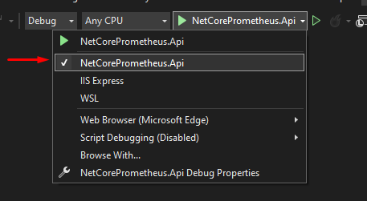
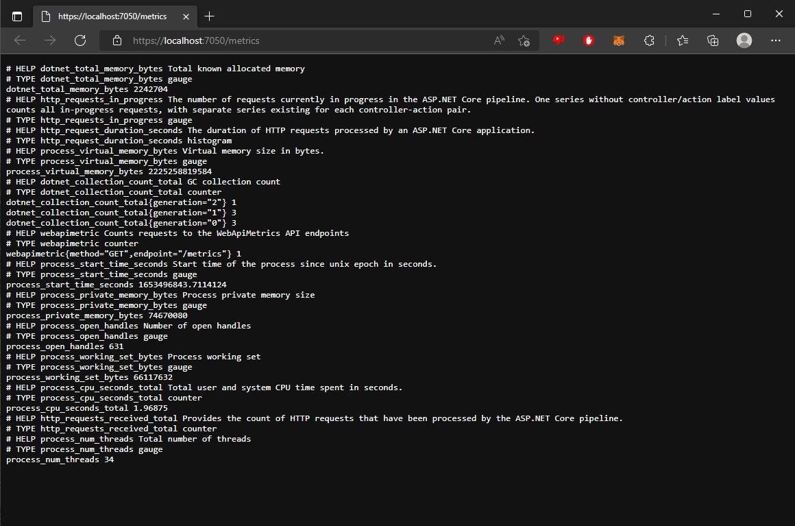

[![Contributors][contributors-shield]][contributors-url]
[![Watchers][watchers-shield]][watchers-url]
[![Stargazers][stars-shield]][stars-url]
[![Forks][forks-shield]][forks-url]
[![Issues][issues-shield]][issues-url]
[![MIT License][license-shield]][license-url]


# Monitorando aplicações .Net Core com Prometheus

>  Monitorar é a ação de: **"acompanhar alguma coisa para consideração, analisando as informações fornecidas por instrumentos técnicos; monitorizar: monitorar um processo, uma operação, um aparelho, etc"**.

---

<!-- TABLE OF CONTENTS -->
### Índice
<ol>
  <li><a href="#introducao">Introdução</a></li>
  <li><a href="#vantagens">Vantagens</a></li>
  <li><a href="#o-que-e-o-prometheus">O que é o Prometheus?</a></li>
  
  <li><a href="#projeto">Projeto</a></li>
  <ol>
    <li><a href="#api">API</a></li>
    <li><a href="#configurando-o-prometheus">Configurando o Prometheus</a></li>
    <li><a href="#docker">Docker</a></li>
    <li><a href="#testando">Testando</a></li>
  </ol>

  <li><a href="#como-posso-contribuir">Como posso contribuir?</a></li>
  <li><a href="#licenca">Licença</a></li>
  <li><a href="#sobre-o-autor">Sobre o autor</a></li>
  <!--
  <li><a href="#doacoes">Doações</a></li>
  -->
</ol>

---

## Introdução

O monitoramento de aplicações e servidores é uma parte importante do dia-a-dia do desenvolvedor de software. Isso inclui diversos tipos de análises, desde o monitoramento contínuo de possíveis exceções até o uso de CPU, memória e armazenamento do servidor. 

Outro item importante do monitoramento é a capacidade de configurar alarmes, por exemplo, você pode querer receber um alerta através de algum canal conhecido como e-mail, chat, sms, sempre que ocorrer alguma indisponibilidade ou falha de processo na sua API.

Um ponto relevante sobre métricas é entendermos o que é APM (Application Performance Management). APMs são serviços que visam garantir que os softwares atendam seus requisitos de desempenho e performance. Ele monitora pontos sobre velocidade de transações de softwares, infraestrutura de rede, sistemas entre outros. São software que auxiliam no troubleshooting de aplicaçõe para resolução de problemas.

## Vantagens

Podemos destacar várias vantagens de usar essas ferramentas para aumentar o controle de dados. Como estamos olhando muito para a Open Finance este ano, podemos falar um pouco sobre como estas ferramentas podem ajudar a trazer controle e governança sobre os processos bancários.

Quando você integra seu software com as APIs do banco, você abre uma gama de possibilidades, mas e quanto ao controle de tudo isso? Como monitorar se os serviços que suportam essas interações estão funcionando corretamente? A resposta a estas perguntas é o monitoramento, que pode ser feito usando o Prometheus, AlertManager, Grafana e outros sistemas.

Ao ter um monitoramento eficaz, você pode:

1. Ter mais agilidade na solução de problemas;
2. Identificar instabilidades e picos de transação de alto volume;
3. Maior controle de dados.

E estes são alguns dos muitos benefícios que o rastreamento de dados pode trazer ao seu negócio.

## O que é o Prometheus?

De acordo com o [github da ferramenta](https://github.com/prometheus/prometheus), o **Prometheus** é um sistema de monitoramento para serviços e aplicações. Ele coleta as métricas de seus alvos em determinados intervalos, avalia expressões de regras, exibe os resultados e também pode acionar alertas se alguma condição for observada como verdadeira.

Dentre muitas, estas são principais características do Prometheus:

* É um modelo de dados multi-dimensional (time series).
* Possui uma linguagem própria (PromQL) para queries de dados em formato time series.
* Totalmente autônomo, sem dependência de armazenamento externo.
* A coleta das métricas ocorre com um modelo pull e via HTTP.
* Também é possível enviar métricas através de um gateway intermediário.
* A definição dos serviços a serem monitorados pode ser feita através de uma configuração estática ou através de descoberta.
* Possui vários modos de suporte a gráficos e painéis.

Este tutorial tem como objetivo de focar no entendimento sobre como configurar a coleta de métricas — utilizando o modelo pull via HTTP — na sua aplicação e também a visualização delas. Sendo assim, aqui não serão abordados assuntos como configuração e implantação do Prometheus. Contudo, para ter uma ideia do funcionamento geral da ferramenta, é interessante entender como funcionam os componentes internos do Prometheus.

## Projeto

O projeto de exemplo irá mostrar como é feito a configuração do Prometheus em uma API com .Net Core 6.0.


### API

Iremos criar uma ASP.NET Core Web API, para isso siga o próximo passos:

Inicie o Visual Studio e clique em Create a new project


Escolha o tipo de projeto: ASP.NET Core Web API


Escolha o Nome para seu projeto, nosso exemplo irá se chamar: NetCorePrometheus e o local que o seu projeto irá ficar no seu computador. Agora clique em Create


Escolha API e clique em Create.


No Solution Explorer veremos as dependência do projeto


A biblioteca que iremos utilizar pode ser encontrada no [Nuget](https://github.com/prometheus-net/prometheus-net) (utilizaremos a ultima versão até o momento de escrita deste artigo v6.0.0):

```xml
<PackageReference Include="prometheus-net.AspNetCore" Version="6.0.0" />
```

Neste momento iremos buscar a biblioteca prometheus-net.AspNet no Nuget.
Abra o Package Manager Console e execute o seguinte comando:

```bash
Install-Package prometheus-net.AspNetCore
```


Após a instalação, poderemos ver a biblioteca nas dependências do projeto.


Agora iremos incluir a configuração do Prometheus na classe 'Program.cs'. Portanto, vamos criar uma nova classe denominada `PrometheusConfig.cs` com a seguinte estrutura:

```csharp
    public static class PrometheusConfig
    {
        public static IApplicationBuilder UsePrometheusConfiguration(this IApplicationBuilder app)
        {
            // Custom Metrics to count requests for each endpoint and the method
            var counter = Metrics.CreateCounter("webapimetric", "Counts requests to the WebApiMetrics API endpoints",
                new CounterConfiguration
                {
                    LabelNames = new[] { "method", "endpoint" }
                });

            app.Use((context, next) =>
            {
                counter.WithLabels(context.Request.Method, context.Request.Path).Inc();
                return next();
            });

            // Use the prometheus middleware
            app.UseMetricServer();
            app.UseHttpMetrics();

            return app;

        }
    }
```

Na classe `Program.cs`, iremos adicionar a chamada da classe recém criada antes de HttpsRedirection:

```csharp
...
app.UsePrometheusConfiguration(); // Configuração do Prometheus
app.UseHttpsRedirection();
...

```


O parte da configuração customizada irá nos ajudar a gerar informações de todas as requisições que nossas controllers irão receber.

```csharp
            // Custom Metrics to count requests for each endpoint and the method
            var counter = Metrics.CreateCounter("webapimetric", "Counts requests to the WebApiMetrics API endpoints",
                new CounterConfiguration
                {
                    LabelNames = new[] { "method", "endpoint" }
                });

            app.Use((context, next) =>
            {
                counter.WithLabels(context.Request.Method, context.Request.Path).Inc();
                return next();
            });
```

Mude o launch do projeto para NetCorePrometheus.Api



Uma última configuração na API, no arquivo launchSettings.json, modifique o valor da propriedade launchUrl para metrics.


Após essa última configuração, ao executarmos a aplicação pressionando “F5” poderemos ver o endpoint “/metrics” que a biblioteca do Prometheus criou para monitorar as informações da nossa API..



Muito bem, neste momento, temos nossa api devidamente configurada para gerar suas métricas.

---

`Models\Cpf.cs`
```csharp
namespace NetCorePrometheus.Api.Models
{
	public class Cpf
	{
		public string Number { get; private set; }
		public bool IsValid { get; private set; }

		public Cpf(string cpf)
		{
			IsValid = IsCpf(cpf);
			Number = cpf;
		}

		public string GetNumber()
		{
			return Number;
		}

		private bool IsCpf(string number)
		{
			int[] multiplicador1 = new int[9] { 10, 9, 8, 7, 6, 5, 4, 3, 2 };
			int[] multiplicador2 = new int[10] { 11, 10, 9, 8, 7, 6, 5, 4, 3, 2 };
			string tempCpf;
			string digito;
			int soma;
			int resto;

			number = number.Trim();
			number = number.Replace(".", "").Replace("-", "");

			if (number.Length != 11)
				return false;

			tempCpf = number.Substring(0, 9);
			soma = 0;

			for (int i = 0; i < 9; i++)
				soma += int.Parse(tempCpf[i].ToString()) * multiplicador1[i];

			resto = soma % 11;

			if (resto < 2)
				resto = 0;
			else
				resto = 11 - resto;

			digito = resto.ToString();
			tempCpf = tempCpf + digito;
			soma = 0;

			for (int i = 0; i < 10; i++)
				soma += int.Parse(tempCpf[i].ToString()) * multiplicador2[i];

			resto = soma % 11;

			if (resto < 2)
				resto = 0;
			else
				resto = 11 - resto;

			digito = digito + resto.ToString();

			return number.EndsWith(digito);
		}
	}
}
```

`Models\Cliente.cs`
```csharp
namespace NetCorePrometheus.Api.Models
{
    public class Cliente
    {
        public Cliente(int id, string name, string email, string cpf)
        {
            Id = id;
            Name = name;
            Email = email;
            Cpf = new Cpf(cpf);
        }

        public int Id { get; set; }
        public string Name { get; set; }
        public string Email { get; set; }
        public Cpf Cpf { get; set; }

        public bool Validate()
        {
            bool isValid = true;

            if (string.IsNullOrWhiteSpace(Name) || string.IsNullOrWhiteSpace(Email) || Cpf.IsValid)
                isValid = false;

            return isValid;
        }
    }
}
```

`Repositories\ClienteRepository.cs`
```csharp
using NetCorePrometheus.Api.Models;

namespace NetCorePrometheus.Api.Repositories
{
    public class ClienteRepository
    {
        private List<Cliente> _clientes;

        public ClienteRepository()
        {
            _clientes = new List<Cliente>
            {
                new Cliente(1, "Douglas Modesto", "d.modesto@teste.com.br", "045.213.920-16"),
                new Cliente(1, "Martin Diogo Filipe Anthony Jesus", "martindiogojuanjesus__martindiogojuanjesus@urbam.com.br", "980.725.820-03"),
                new Cliente(1, "Diogo Nicolas Carvalho", "diogonicolascarvalho-74@saa.com.br", "406.244.580-83"),
                new Cliente(1, "Ericka Sebastião Silveira", "eerickantoniosilveira@transtelli.com.br", "705.559.730-77"),
                new Cliente(1, "Laura Jaqueline Aline Silva", "laurajaquelinealinesilva__laurajaquelinealinesilva@me.com", "711.605.230-53")
            };
        }

        public Cliente ClienteById(int idCliente)
        {
            return _clientes.FirstOrDefault(x => x.Id == idCliente);
        }

        public IEnumerable<Cliente> GetClientes()
        {
            return _clientes;
        }

        public bool Save(Cliente cliente)
        {
            return true;
        }
    }
}
```

`Controllers\ClienteController.cs`
```csharp
using Microsoft.AspNetCore.Mvc;
using NetCorePrometheus.Api.Models;
using NetCorePrometheus.Api.Repositories;

namespace NetCorePrometheus.Api.Controllers
{
    [ApiController]
    [Route("api/clientes")]
    public class ClienteController : ControllerBase
    {
        private readonly ILogger<ClienteController> _logger;
        private ClienteRepository _clienteRepository;

        public ClienteController(ILogger<ClienteController> logger)
        {
            _logger = logger;
            _clienteRepository = new ClienteRepository();
        }

        [HttpGet]
        [Route("")]
        public IEnumerable<Cliente> Clientes()
        {
            return _clienteRepository.GetClientes();
        }


        [HttpGet]
        [Route("cliente")]
        public Cliente ClienteById([FromQuery] int id)
        {
            return _clienteRepository.ClienteById(id);
        }
    }
}
```


---


Agora que sabemos o que é o Prometheus e o seu propósito, vamos ver ele trabalhando na prática. O objetivo é entendermos como o Prometheus Server funciona e como podemos configurá-lo para coletar métricas da nossa api.


### Docker

#### Pré-requisitos

Afim de termos uma boa experiência com o laboratório proposto neste artigo, será necessário a instalação de algumas ferramentas que são o Docker e Docker Compose.

Segue abaixo os links das instalações oficiais:

* [Docker CE (Community Edition)](https://docs.docker.com/engine/install/)
* [Docker Compose](https://docs.docker.com/compose/install/#install-compose)


#### Recapitulando

* Criamos uma controle para Listagem de Clientes e Buscar Cliente por Id
* Configuramos o Swagger para termos nossos endpoints documentados
* Criamos uma configuração para abrir o swagger no start da aplicação.
* Criamos um Dockerfile para fazer o deploy da aplicação dentro de um container.


## Como posso contribuir?

Se você quer ajudar o projeto, aprimorando-o ou criando algo novo, seja bem-vindo. Este projeto foi criado para ser um lar de códigos úteis e reutilizáveis ​​para a comunidade .NET. Portanto, se você tiver algum trecho de código útil, limpo, desacoplado e testado e quiser contribuir para esse objetivo, faça um [pull request](https://github.com/anzolin/netcoreprometheus/pulls)!


## Licença

Este projeto sob a [Licença MIT](https://github.com/anzolin/netcoreprometheus/blob/master/LICENSE).

  
## Sobre o autor

Olá a todos, eu me chamo Diego Anzolin Ferreira. Eu sou um desenvolvedor .Net. Espero que você goste deste projeto tanto quanto eu gostei de desenvolvê-lo. Se você tiver algum problema, você pode postar uma [issue](https://github.com/anzolin/netcoreprometheus/issues). Você pode me contatar em diego@anzolin.com.br.


<!--
## Doações
  
Quer me ajudar a continuar criando projetos open source, faça uma doação:

[](https://www.paypal.com/donate?business=DN2VPNW42RTXY&no_recurring=0&currency_code=BRL) [](https://www.buymeacoffee.com/anzolin)

-->
Obrigado!


<!-- MARKDOWN LINKS & IMAGES -->
<!-- https://www.markdownguide.org/basic-syntax/#reference-style-links -->
[contributors-shield]: https://img.shields.io/github/contributors/anzolin/netcoreprometheus.svg?style=for-the-badge
[contributors-url]: https://github.com/anzolin/netcoreprometheus/graphs/contributors
[forks-shield]: https://img.shields.io/github/forks/anzolin/netcoreprometheus.svg?style=for-the-badge
[forks-url]: https://github.com/anzolin/netcoreprometheus/network/members
[watchers-shield]: https://img.shields.io/github/watchers/anzolin/netcoreprometheus.svg?style=for-the-badge
[watchers-url]: https://github.com/anzolin/netcoreprometheus/watchers
[stars-shield]: https://img.shields.io/github/stars/anzolin/netcoreprometheus.svg?style=for-the-badge
[stars-url]: https://github.com/anzolin/netcoreprometheus/stargazers
[issues-shield]: https://img.shields.io/github/issues/anzolin/netcoreprometheus.svg?style=for-the-badge
[issues-url]: https://github.com/anzolin/netcoreprometheus/issues
[license-shield]: https://img.shields.io/github/license/anzolin/netcoreprometheus.svg?style=for-the-badge
[license-url]: https://github.com/anzolin/netcoreprometheus/blob/master/LICENSE.txt


<!--

https://medium.com/guide-lab/monitoramento-prometheus-grafana-e-net-core-3-1-parte-1-63a43b845e9f

https://medium.com/guide-lab/monitoramento-prometheus-grafana-e-net-core-3-1-parte-2-5f1c590b6c7f

-->